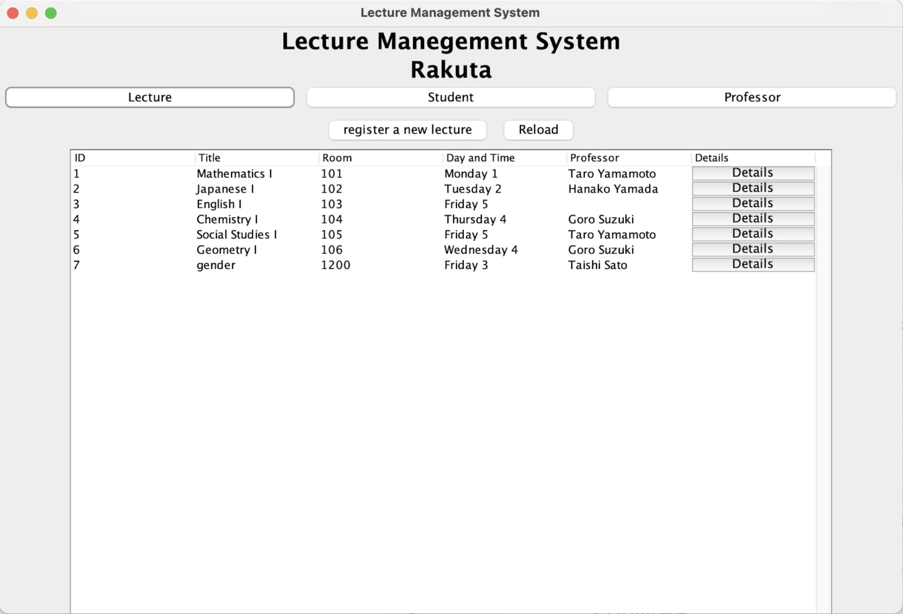

# Primitive Lecture Management System for University


# How to use
Compile all java files
```java
javac *.java
```

Run MyApp
```
java -cp .:sqlite-jdbc-3.46.0.0.jar:slf4j-api-1.7.32.jar:slf4j-api-1.7.32.jar MyApp
```

When you want to reset .db
```
sqlite3 -column -header data.db 

sqlite> .read ./create_table.sql
sqlite> .read ./insert_into.sql
```
